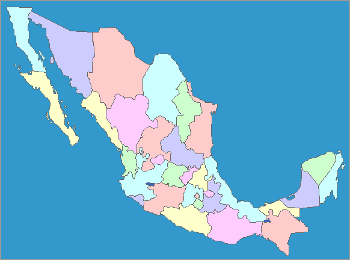

# Aplicación Dash sobre Indicadores de México

Los datos utilizados en esta aplicación provienen de fuentes oficiales de México, como el **INEGI** y la **Secretaría de Salud**. Los gráficos reflejan indicadores relevantes como la **tasa de natalidad**, **mortalidad**, **escolaridad**, y otros aspectos demográficos y sociales importantes.  

Mapa programado por:  
Oswaldo Rendón Lira  
Marco Iván Rodríguez Graciano  

Página basada en el repositorio de Dash Gallery App: Opioid Epidemic  
Información y datos obtenidos de datos oficiales del Gobierno Mexicano.

---

## Introducción

Esta aplicación utiliza **Dash** para proporcionar una visualización interactiva de los indicadores clave en México. Su propósito es permitir a los usuarios explorar tendencias demográficas y sociales de forma dinámica y personalizada.

